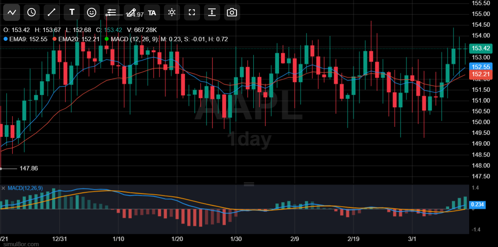
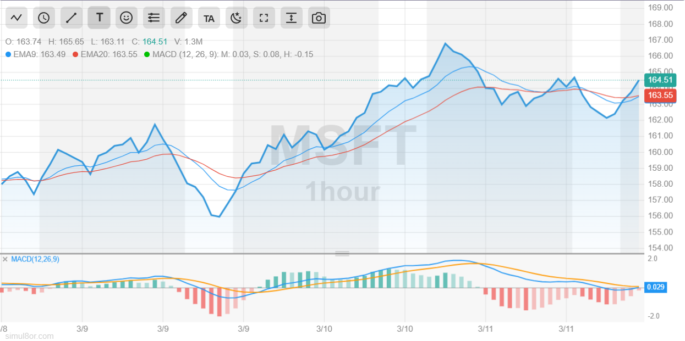

# JavaScript Stock Charts

**[View Live Demo on simul8or.com](https://simul8or.com/javascript-stock-chart.php)** - See the full capabilities in action with interactive examples and documentation.



A lightweight, zero-dependency JavaScript stock chart library for financial data visualization. Built on HTML5 Canvas with HiDPI support, technical indicators, candlestick pattern detection, and real-time interactivity.

## Features

### Core
- **Candlestick & Line Charts** - Toggle between chart types with a single click
- **HiDPI Rendering** - Crisp visuals on Retina and high-DPI displays
- **Dark/Light Mode** - Built-in theme switching
- **Responsive Design** - Adapts to any screen size, mobile-friendly with touch/pinch support
- **Volume Panel** - Toggleable volume bars below price data
- **Fullscreen Mode** - Expand charts with one click
- **Screenshot to Clipboard** - Copy chart as PNG with embedded branding

  

### Technical Indicators
Built-in support for popular indicators via the included `indicators.js` module:

- **RSI** - Relative Strength Index
- **MACD** - Moving Average Convergence Divergence
- **Bollinger Bands** - Volatility bands around a moving average
- **Stochastic** - Momentum oscillator
- **ATR** - Average True Range
- **OBV** - On-Balance Volume
- **ADX** - Average Directional Index
- **CCI** - Commodity Channel Index
- **Williams %R** - Momentum indicator
- **MFI** - Money Flow Index
- **Moving Averages** - Customizable SMA/EMA with color picker

### Pattern Detection
Automatic candlestick pattern recognition via the included `patterns.js` module:

- Engulfing (bullish/bearish)
- Doji, Hammer, Shooting Star
- Morning/Evening Star
- And more

### Interactive Controls
- **Drag** - Pan horizontally and vertically
- **Mouse Wheel** - Zoom in/out
- **Pinch** - Zoom on touch devices
- **Hover** - Crosshair with real-time OHLC data
- **Price Scale Drag** - Adjust vertical scaling
- **Timeframe Selector** - Switch between 1min, 5min, 15min, 1hour, 4hour, daily, weekly
- **Drawing Tools** - Trendlines and Fibonacci retracements
- **AI Price Levels** - Overlay support/resistance levels programmatically

## Installation

Include the source files in your HTML:

```html
<link rel="stylesheet" href="stock-chart.css">
<script src="indicators.js"></script>
<script src="patterns.js"></script>
<script src="stock-chart.js"></script>
```

## Quick Start

```html
<div id="chart-container" style="width: 100%; height: 500px;"></div>

<script>
  const data = [
    { t: 1675209600000, open: 180.68, high: 187.12, low: 179.26, close: 185.38, volume: 4235600 },
    { t: 1675296000000, open: 186.12, high: 194.32, low: 185.21, close: 188.74, volume: 5127800 },
    // ... more data points
  ];

  const chart = new StockChart('chart-container', {
    data: data,
    ticker: 'AAPL',
    darkMode: true,
    chartType: 'candlestick',
    timeframe: '1day'
  });
</script>
```

## Configuration Options

```javascript
const chart = new StockChart('container', {
  // Required
  data: ohlcData,           // Array of { t, open, high, low, close, volume }
  ticker: 'NVDA',           // Stock symbol (displayed as watermark)

  // Optional
  chartType: 'candlestick', // 'candlestick' or 'line'
  darkMode: false,          // Enable dark mode
  timeframe: '1day',        // '1min', '5min', '15min', '1hour', '4hour', '1day', '1week', '1month'

  // Indicators (enable/disable programmatically)
  indicators: {
    rsi: true,
    macd: false,
    bollingerBands: false
  },

  // Moving averages
  movingAverages: [
    { type: 'sma', period: 20, enabled: true, color: '#2196F3' },
    { type: 'ema', period: 50, enabled: true, color: '#FF9800' }
  ]
});
```

## API Methods

```javascript
// Redraw the chart
chart.drawCharts();

// Destroy the chart and clean up
chart.destroy();

// Update configuration
chart.config.darkMode = true;
chart.drawCharts();

// AI price level overlays
chart.addAIPriceLevel({ label: 'Entry', price: 185.50, color: '#00C851' });
chart.setAIPriceLevels([
  { label: 'Stop Loss', price: 178.00 },
  { label: 'Target', price: 195.00 }
]);
chart.clearAIPriceLevels();

// Handle container resize
window.addEventListener('resize', () => chart.resizeCanvases());
```

## Browser Support

- Modern browsers with HTML5 Canvas support
- Chrome, Firefox, Safari, Edge
- Mobile browsers on iOS and Android

## Performance

- Canvas-based rendering (not SVG/DOM) for large datasets
- HiDPI-aware with devicePixelRatio scaling
- Debounced resize handling
- Optimized for both desktop and mobile

## Contributing

Contributions are welcome! Please feel free to submit a Pull Request.

## License

This project is licensed under the MIT License with an attribution requirement - the built-in branding link to simul8or.com must remain visible and functional. See the LICENSE file for details.

---

Powered by [simul8or](https://simul8or.com)
