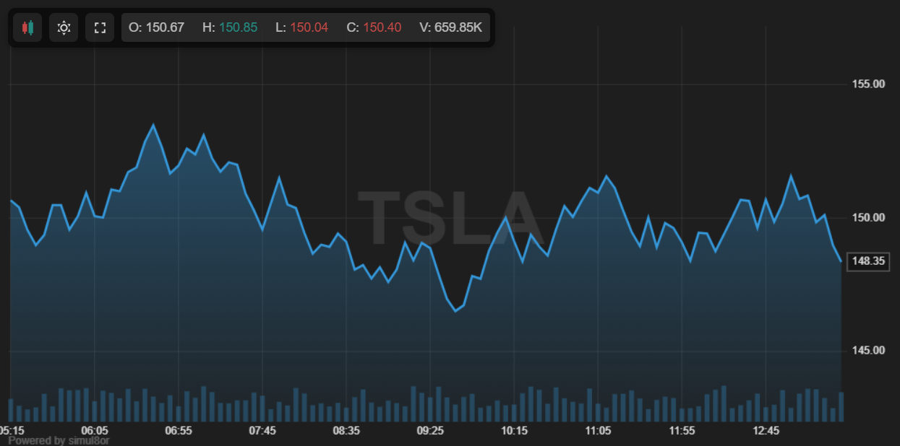
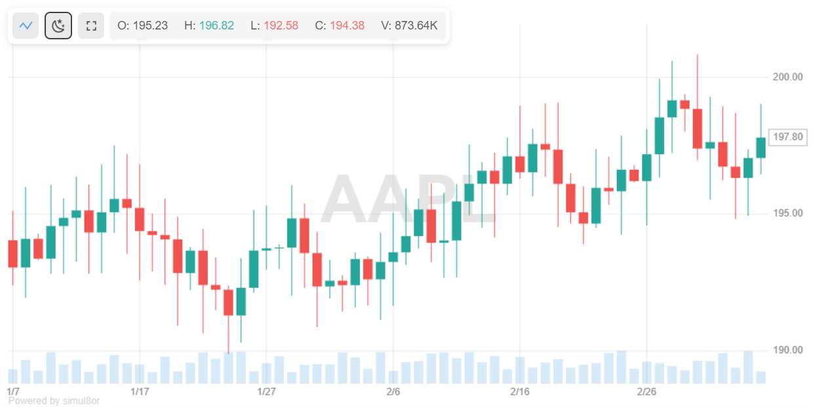

# JavaScript Stock Charts

**[➡️ View Live Demo on simul8or.com](https://simul8or.com/javascript-stock-chart.php)** - See the full capabilities in action with interactive examples and documentation.



A beautiful, responsive, lightweight chart library for financial data visualization with zero dependencies. Create professional-grade stock charts with candlestick and line views in a simple JavaScript class.

## Features

- **Multiple Chart Types** - Toggle between candlestick and line chart views with a single click
- **Interactive Navigation** - Drag to pan, scroll to zoom, touch-friendly controls
- **Responsive Design** - Automatically adapts to any screen size from mobile to desktop
- **Dark/Light Mode** - Built-in theme switching
  
  

- **Real-Time OHLC Display** - Shows precise price data on hover
- **Customizable** - Configure colors, watermarks, and display options
- **Volume Visualization** - Volume bars displayed below price data
- **Fullscreen Mode** - Expand charts with a single click

## Installation

Simply include the source files in your HTML:

```html
<script src="stock-chart.js"></script>
<link rel="stylesheet" href="stock-chart.css">
```

## Quick Start

```html
<div id="chart-container" style="width: 100%; height: 400px;"></div>

<script>
  // Sample OHLC data
  const data = [
    { t: 1675209600000, open: 180.68, high: 187.12, low: 179.26, close: 185.38, volume: 4235600 },
    { t: 1675296000000, open: 186.12, high: 194.32, low: 185.21, close: 188.74, volume: 5127800 },
    // ... more data points
  ];
  
  // Initialize chart
  const chart = new StockChart('chart-container', {
    data: data,
    ticker: 'AAPL',
    darkMode: true
  });
</script>
```

## Configuration Options

```javascript
const chart = new StockChart('container', {
  // Required
  data: ohlcData,  // Array of { t, open, high, low, close, volume }
  ticker: 'NVDA',  // Stock symbol (displayed as watermark)
  chartType: 'candlestick', // or 'line'
  darkMode: false // Enable dark mode
});
```

## Interactive Features

StockChart.js provides multiple ways to interact with your chart:

- **Drag**: Click and drag to pan horizontally and vertically
- **Mouse Wheel**: Zoom in/out to adjust the visible range
- **Pinch**: On touch devices, pinch to zoom
- **Hover**: Move mouse over chart to see crosshair and detailed OHLC data
- **Right Scale**: Drag the price scale area to adjust vertical scaling
- **Buttons**: Toggle chart type, dark/light mode, and fullscreen

## Customization

Use CSS to customize the look and feel of your charts:

```css
.sc-chart-container {
  border-radius: 10px;
  box-shadow: 0 4px 12px rgba(0, 0, 0, 0.1);
}

.sc-chart-container.dark-mode {
  --chart-bg: #131722;
  --text-color: #d1d4dc;
}
```

## Working with the Chart

The StockChart object provides several methods and properties that can be used to control the chart after initialization:

```javascript
// Force a redraw of the chart
chart.drawCharts();

// Destroy the chart and clean up event listeners
chart.destroy();

// Adjust visibility settings
chart.config.watermark.enabled = false;
chart.config.darkMode = true;
chart.updateConfig();
chart.drawCharts();

// Resize the canvas when container size changes
window.addEventListener('resize', function() {
  chart.resizeCanvases();
});
```

## Browser Support

- Modern browsers with HTML5 Canvas support
- Chrome, Firefox, Safari, Edge
- Mobile browsers on iOS and Android

## Performance Notes

StockChart.js is optimized for performance with large datasets:

- Uses canvas for rendering instead of SVG or DOM elements
- Implements debounced resize event handling
- Efficiently handles zooming and panning
- Optimized for both desktop and mobile devices

## Contributing

Contributions are welcome! Please feel free to submit a Pull Request.

## License

This project is licensed under the MIT License - see the LICENSE file for details.

---

Powered by [simul8or](https://simul8or.com)
